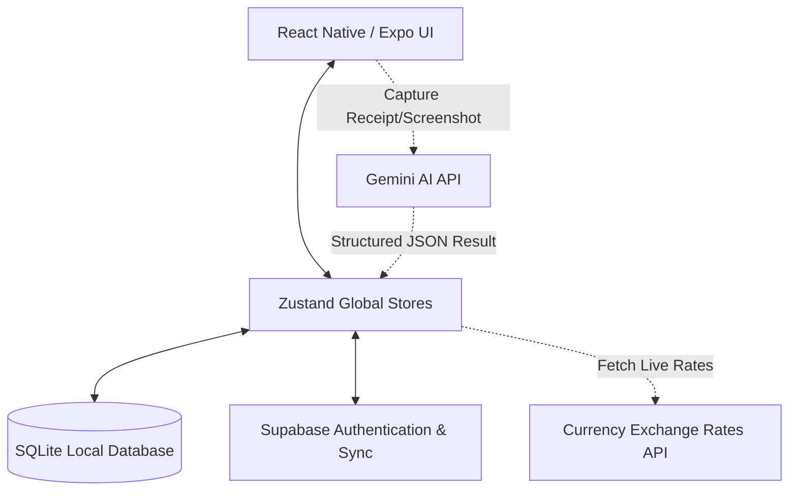

# 🪙 SmartExpense AI

<p align="center">
  <strong>A premium, intelligent, offline-first personal finance tracker powered by Google Gemini AI & Supabase.</strong>
</p>

<p align="center">
  
  
  
  
  
  
  
</p>

<p align="center">
  <a href="https://apps.apple.com/app/your-app-id" target="_blank">
    
  </a>
  &nbsp;
  <a href="https://play.google.com/store/apps/details?id=com.nkexpo.expense" target="_blank">
    
  </a>
</p>

---

## 📖 Table of Contents
1. [Download App](#-download-app)
2. [Key Features](#-key-features)
3. [Architecture Design](#-architecture-design)
4. [Project Directory Structure](#-project-directory-structure)
5. [Getting Started](#-getting-started)
6. [Environment Variables](#-environment-variables)
7. [Supported Spending Categories](#-supported-spending-categories)
8. [Contributing](#-contributing)
9. [License](#-license)

---

## 📲 Download App

You can install SmartExpense AI on your mobile device through the official app stores or run a development version:

*   🍏 **Apple App Store**: [Download for iOS](https://apps.apple.com/app/your-app-id) *(Coming Soon)*
*   🤖 **Google Play Store**: [Download for Android](https://play.google.com/store/apps/details?id=com.nkexpo.expense) *(Coming Soon)*
*   🚀 **Expo Go / EAS Project**: View the project builds and updates on the [Expo Project Dashboard](https://expo.dev/projects/expense).

---

## ✨ Key Features

SmartExpense AI is designed to minimize the friction of tracking expenses by combining local database performance with smart cloud services:

*   🤖 **Gemini-Powered OCR Scanner**: Capture photos of physical paper receipts. Gemini AI analyzes the image, extracts the merchant, total amount, taxes, date, payment method, and individual line items with high precision.
*   📸 **UPI Screenshot Auto-Detection**: Upload a payment confirmation screenshot from Google Pay, PhonePe, or Paytm. The app parses the image, retrieves the transaction details, and inserts them automatically.
*   🧠 **AI Category Classifier**: Instantly maps merchant names to spending categories (e.g., Starbucks to `Food`, Walmart to `Grocery`) in milliseconds using smart heuristic analysis.
*   ⚡ **Offline-First SQLite Cache**: Full database capabilities offline. Save, delete, edit, or set budgets without an internet connection using an optimized SQLite layer.
*   ☁️ **Supabase Cloud Syncing**: Secure email & password auth with automatic cloud database synchronization when connected to the internet.
*   📊 **Visual Analytics**: Interactive bar charts and pie charts powered by `react-native-gifted-charts` mapping monthly/category spending trends.
*   💸 **Multi-Currency Converter**: Live dynamic exchange rate sync enabling smooth expense tracking in your default currency (INR, USD, EUR, etc.).

---

## 🏗️ Architecture Design

The application utilizes a local-first repository architecture: UI components pull state from Zustand stores, which serve as the source of truth, backed by a persistent SQLite database cache and real-time Supabase cloud sync.



---

## 📂 Project Directory Structure

```text
├── assets/                  # App icons, splash screens, and mock receipt samples
├── src/
│   ├── app/                 # Expo Router file-based screens
│   │   ├── (tabs)/          # Main tabs (Home/Dashboard, Expenses, Analytics, AI Hub, Settings)
│   │   ├── auth/            # Registration, Login, and Password Recovery flows
│   │   └── modal/           # Form modals (Add Transaction, Scan Receipt, Screenshot Import, Budgeting)
│   ├── components/          # Reusable UI widgets (Cards, EmptyState, Skeletons, Detail Modals)
│   ├── constants/           # Visual styling tokens, dark/light theme configurations
│   ├── database/            # SQLite tables initialization schema
│   │   └── repositories/    # SQLite queries layer (CRUD logic for transactions, settings, budgets)
│   ├── hooks/               # Custom react hooks (Theme preferences, device hardware access)
│   ├── lib/                 # Core library initiations (Supabase Client instantiation)
│   ├── services/            # API services (Gemini OCR engine, OCR parsers, Notifications)
│   ├── store/               # Zustand global store states (Auth, Expense, Settings, Currency)
│   ├── types/               # TypeScript interface configurations
│   └── utils/               # Formatting helper functions and warning suppressors
```

---

## 🚀 Getting Started

Follow these steps to run the application in development mode:

### 1. Prerequisites
- [Node.js](https://nodejs.org/) (v18 or higher recommended)
- [npm](https://www.npmjs.com/) or [yarn](https://yarnpkg.com/)
- [Expo Go](https://expo.dev/go) app installed on your physical device, or an iOS Simulator / Android Emulator running on your computer.

### 2. Install Dependencies
Clone the repository and install all required modules:
```bash
npm install
```

### 3. Setup Environment Variables
Create a `.env` file in the root directory. You can copy the template provided:
```bash
cp .env.example .env
```
Fill in your Supabase connection strings and Gemini API key as detailed in [Environment Variables](#-environment-variables).

### 4. Run the Development Server
Start the Metro bundler:
```bash
npm start
```

Use the interactive keyboard commands in your terminal to open the application:
- Press <kbd>a</kbd> to open in the **Android Emulator**.
- Press <kbd>i</kbd> to open in the **iOS Simulator**.
- Press <kbd>w</kbd> to open in the **Web Browser**.
- Scan the QR code on your terminal using the **Expo Go app** on your mobile device to test natively.

---

## 🔑 Environment Variables

The project uses `.env` configuration files to hook up remote OCR and databases securely.

| Variable | Description | Required |
| :--- | :--- | :--- |
| `EXPO_PUBLIC_GEMINI_API_KEY` | Google Gemini API key used to process cloud receipt images. | Yes (for OCR) |
| `GEMINI_API_KEY` | Server-side Gemini API key fallback. | Yes (for OCR) |
| `EXPO_PUBLIC_SUPABASE_URL` | Your Supabase database endpoint URL. | Yes |
| `EXPO_PUBLIC_SUPABASE_ANON_KEY` | Your Supabase public anonymous API key. | Yes |

> [!NOTE]
> For local development, if no `EXPO_PUBLIC_GEMINI_API_KEY` is provided, the application will fallback to simulated OCR results for preset files (`starbucks_receipt.png`, `walmart_receipt.png`, etc.) without hitting the cloud API.

---

## 🏷️ Supported Spending Categories

The AI classifier parses merchant names and maps them to one of the following structured categories:

- 🍕 **Food**: Cafes, restaurants, food deliveries (Swiggy, Zomato, Starbucks, McDonald's).
- 🛒 **Grocery**: Supermarkets, grocery outlets (Walmart, Target, Costco, Trader Joe's).
- ✈️ **Travel**: Flights, taxi rides, trains, hotel bookings (Uber, Airbnb, airlines).
- ⛽ **Fuel**: Gas stations and petrol pumps (Shell, Chevron, Exxon).
- 🛍️ **Shopping**: Apparel stores, online retail (Amazon, Zara, Nike, eBay).
- 🎬 **Entertainment**: Streaming platforms, movies, gaming (Netflix, Spotify, Steam, PlayStation).
- 🔌 **Bills**: Utilities, internet invoices, mobile recharges (AT&T, Verizon, electricity, insurance).
- 🏥 **Health**: Medical consultations, pharmacies, gyms, clinical checkups (CVS, fitness clubs).
- 🏠 **Rent**: Monthly housing leases, mortgages, and landlord payouts.
- 💳 **EMI**: Loan installments, credit card bills, financing interest.
- 📚 **Education**: School fees, online courses, educational book purchases (Udemy, Coursera).
- 📦 **Other**: General fallback for uncategorized merchants.

---

## 🤝 Contributing

Contributions are what make the open source community such an amazing place to learn, inspire, and create. Any contributions you make are **greatly appreciated**.

1. Fork the Project
2. Create your Feature Branch (`git checkout -b feature/AmazingFeature`)
3. Commit your Changes (`git commit -m 'Add some AmazingFeature'`)
4. Push to the Branch (`git push origin feature/AmazingFeature`)
5. Open a Pull Request

---

## 📄 License

Distributed under the MIT License. See `LICENSE` for more information.
